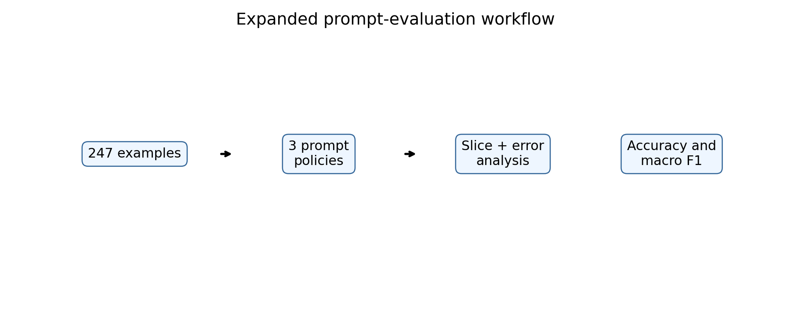

# Prompt Evaluation for Sentiment Classification



Figure: an expanded prompt-evaluation workflow with generated test examples, prompt policies, slice analysis, and error analysis.

## Motivation

Prompt evaluation should not rely on a few cherry-picked examples. A prompt can look strong on easy sentences but fail on mixed, cautious, or domain-specific cases. This project evaluates prompt behavior across a larger labeled benchmark.

## Project Goal

We compared three prompt policies for sentiment classification:

- A short label-only prompt
- A cautious prompt that predicts neutral unless sentiment evidence is strong
- A balanced reasoning prompt that weighs positive and negative evidence

This project simulates prompt behavior with deterministic keyword policies. It is not a real LLM benchmark, but it is useful for showing how prompt rules can be evaluated systematically.

## Dataset

The expanded dataset contains 247 labeled examples across four slices:

- Clear positive sentences
- Clear negative sentences
- Neutral method/reporting sentences
- Mixed-risk sentences with both positive and negative evidence

Labels are positive, neutral, and negative.

## Tools

Python, pandas, scikit-learn, and matplotlib.

## Method

Each prompt policy classifies the same 247 examples. We calculate accuracy, macro F1, weighted F1, confusion matrices, slice-level metrics, and an error-analysis table.

## Results

| Prompt Policy | Accuracy | Macro F1 | Weighted F1 |
|---|---:|---:|---:|
| Balanced reasoning prompt | 0.9271 | 0.9168 | 0.9283 |
| Short label prompt | 0.8543 | 0.8389 | 0.8607 |
| Clinical cautious prompt | 0.2227 | 0.1727 | 0.1699 |


Result files:

- `results/sentiment_examples.csv`
- `results/prompt_metrics.csv`
- `results/slice_metrics.csv`
- `results/error_analysis.csv`
- `results/all_prompt_predictions.csv`
- `results/*_classification_report.csv`
- `results/*_confusion_matrix.csv`
- `results/*_confusion_matrix.png`

## Interpretation

The balanced prompt performs best because it handles mixed evidence more carefully. The short prompt is also useful but makes more mistakes on mixed-risk sentences.

The cautious prompt performs poorly because its neutral bias is too strong. It avoids risky positive/negative decisions, but this causes many true positive and true negative examples to be labeled neutral. This is an important lesson: being cautious is not automatically better if the task requires decisive classification.

## Conclusion

The project now has a larger evaluation set and clearer error analysis. A stronger next step is to replace the deterministic prompt simulator with real LLM calls on a public sentiment dataset.

## How To Run

```bash
pip install -r requirements.txt
python 1_prompt_evaluation.py
```
