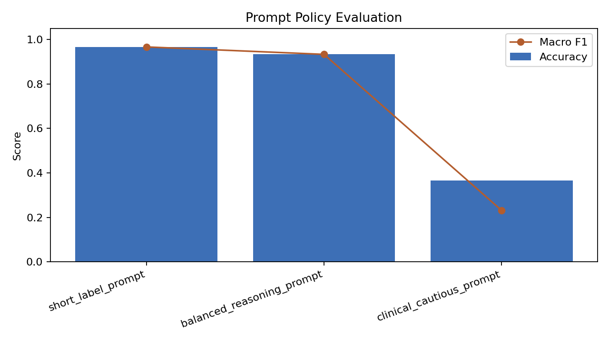

# Report: Prompt Evaluation for Sentiment Classification

## Motivation

Prompt quality should be tested with evidence, not judged only by intuition. This lab studies how direct, cautious, and balanced prompt styles behave on the same sentiment classification examples.

## Dataset

The dataset contains 30 short sentences: 10 positive, 10 negative, and 10 neutral. The examples cover plain sentiment, AI-system feedback, engineering statements, academic descriptions, ambiguous wording, and mixed clauses.

## Tools

Python, pandas, scikit-learn metrics, and matplotlib.

## Method

Three prompt styles are implemented as transparent local policies. This keeps the lab reproducible without external API access. For each policy, the script saves prompt templates, predictions, rationales, aggregate metrics, slice metrics, confusion matrices, classification reports, and an error-analysis table.

## Hyperparameters

No model training is used. The experiment uses three labels, three prompt policies, 30 examples, and fixed neutral-bias settings. The cautious prompt has a stronger neutral bias than the direct and balanced prompts.

## Results

| Prompt Policy | Accuracy | Macro F1 |
|---|---:|---:|
| short_label_prompt | 0.9667 | 0.9666 |
| balanced_reasoning_prompt | 0.9333 | 0.9332 |
| clinical_cautious_prompt | 0.3667 | 0.2315 |

## Interpretation

The direct prompt performs best on this controlled dataset. The balanced prompt is close, but it can overreact to negative evidence in mixed or academic sentences. The cautious prompt performs poorly because it predicts neutral too often. This is an important research lesson: conservative prompting can reduce risk in some settings, but it can also damage recall.

## Conclusion

The project gives a clean offline workflow for prompt evaluation. It should not be treated as a real LLM benchmark. The next step is to run the same evaluation structure with actual LLM outputs and a larger public sentiment dataset.
